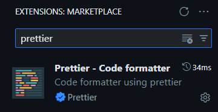
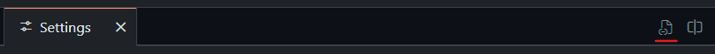
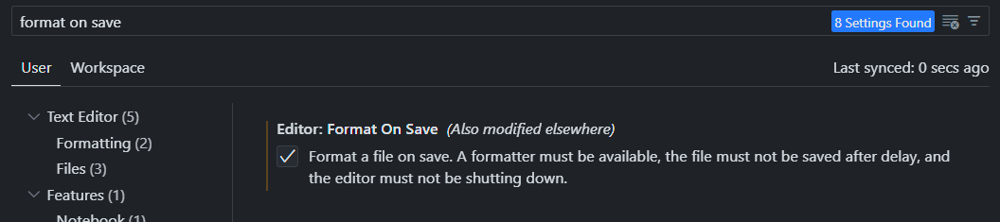

# Plan lekcji ZS2 Ostrzeszów

## Konfiguracja środowiska
### Pierwsze pobranie
```
npm i
```

### Uruchomienie aplikacji
```
npm start
```

### Formatowanie
Dla dobra każdego, przed dodawaniem kodu to tego repozytorium, skonfiguruj formatowanie kodu.


1. Zainstaluj rozszerzenie Prettier w VS Code
2. Dodaj następujące linijki (lub je zedytuj) w pliku JSON ustawień VS Code
    
    ```json
    "[typescript]": {
        "editor.defaultFormatter": "esbenp.prettier-vscode"
    },
    "[typescriptreact]": {
        "editor.defaultFormatter": "esbenp.prettier-vscode"
    },
    "[javascript]": {
        "editor.defaultFormatter": "esbenp.prettier-vscode"
    },
    ```
    Powyższe opcje muszą być pomiędzy klamrami na początku pliku i na końcu.

    Jeśli wklejasz na końcu, za ostatnią opcją postaw przecinek zanim wkleisz.

    Jeśli opcje powyżej już istnieją zmień wartości wewnątrz na podane powyżej.
3. W ustawieniach włącz opcję "Formatuj plik przy zapisywaniu"
   

### Konfiguracja emulatora Android'a
https://docs.expo.dev/workflow/android-studio-emulator/
